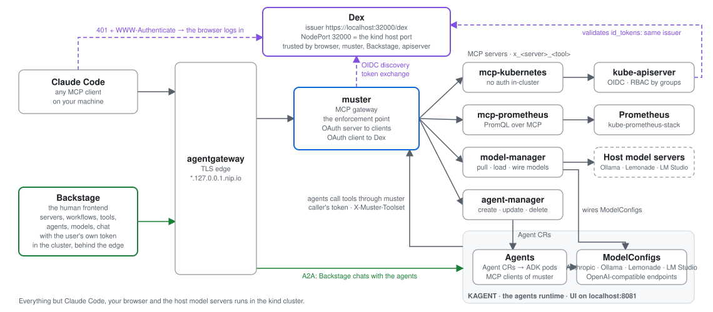

<div align="center">

# agentlab

**The Giant Swarm agent platform on your laptop: one binary, one throwaway
kind cluster, every chain proven end to end.**

[](https://github.com/giantswarm/agentlab/releases)
[](https://dl.circleci.com/status-badge/redirect/gh/giantswarm/agentlab/tree/main)
[](go.mod)
[](LICENSE)

</div>

---

**agentlab** runs the [Giant Swarm agent
platform](https://github.com/giantswarm/agent-platform-standalone) —
[muster](https://github.com/giantswarm/muster) as the MCP gateway, the
Kubernetes MCP server, the [kagent](https://github.com/kagent-dev/kagent)
agents runtime and Giant Swarm's
[Backstage](https://github.com/giantswarm/backstage) portal — on a
[kind](https://kind.sigs.k8s.io/) cluster on your machine, so the whole
platform can be tested and demoed without a management cluster.

Two kinds of client meet at one gateway. MCP clients such as Claude Code talk
to muster directly; people use **Backstage, the human frontend to the whole
platform** — servers, workflows, tools, agents, models — with their own token.
The agents Backstage creates run on kagent and are MCP clients of muster too,
calling tools as the person who invoked them.

The platform needs an identity provider, so the lab bundles its own
[Dex](https://dexidp.io/): users that exist nowhere but this cluster, RBAC
driven by the `groups` claim, and the apiserver, muster and Backstage all
trusting the same issuer.

<div align="center">
  <picture>
    <source media="(prefers-color-scheme: dark)" srcset="docs/img/architecture-dark.svg">
    
  </picture>
</div>

## What's in the box

- **One Go binary.** `agentlab configure` asks every option through an
  interactive form and writes `agentlab.yaml`; every manifest renders from
  embedded templates. No YAML to hand-edit, no scripts to source.
- **The agent platform.** muster behind an agentgateway TLS edge, the single
  OAuth enforcement point in front of an unauthenticated in-cluster
  `mcp-kubernetes`. Per-server sign-in, declared toolsets and a fake
  multi-cluster fleet are all exercised.
- **Backstage, the human frontend.** Giant Swarm's Backstage is how a person
  works the whole platform: browse and sign in to MCP servers, run workflows,
  explore tools, create agents and chat with them, manage models. Every call
  carries the signed-in user's own token, so the portal shows exactly what
  the platform grants that person.
- **Agents.** kagent runs the agents Backstage or agent-manager creates. They
  are MCP clients of muster like Claude Code is, forwarding the caller's token
  and bounded further by declared toolsets, so they see the same catalogue
  under the same rules.
- **Models.** An Anthropic default; extra model configs for OpenAI-compatible,
  Gemini and Ollama endpoints; managed models through model-manager fronting
  an Ollama or Lemonade Server on the host.
- **Observability.** A minimal Prometheus plus mcp-prometheus, so PromQL
  questions about the lab go through MCP too.
- **Identity you can reason about.** Three throwaway users, a fixed group
  vocabulary, one issuer URL valid from the host, the node and every
  hostNetwork pod, and a lab CA you trust explicitly.
- **Proofs, not hope.** Headless `*-test` commands drive every chain — Dex
  login, muster, MCP tools, agents, toolsets, models, RBAC, Backstage — and
  fail loudly.

## Getting started

Requirements: `go` >= 1.25, `docker` (or Podman >= 4), `kind` >= 0.31,
`kubectl`, `helm` >= 4, `git`.

```bash
go install github.com/giantswarm/agentlab@latest   # or a release binary, or `go build -o agentlab .`

export ANTHROPIC_API_KEY=sk-ant-...   # optional: powers the agents and Backstage's AI chat
agentlab configure --defaults         # drop --defaults for the interactive form
agentlab up                           # certs, kind cluster, Dex, RBAC, the platform — verified
agentlab platform-test                # headless proof: Dex -> muster -> mcp-kubernetes -> apiserver
```

Then trust the lab CA once and point Claude Code at the platform:

```bash
agentlab trust                # one sudo prompt; `agentlab untrust` reverts it
export NODE_USE_SYSTEM_CA=1   # Node >= 22.15; older Node: NODE_EXTRA_CA_CERTS=$PWD/certs/ca.crt
claude mcp add --transport http muster https://muster.127.0.0.1.nip.io/mcp
# in Claude Code:  /mcp  ->  authenticate  ->  Dex login page  ->  done
```

The portal is at <https://backstage.127.0.0.1.nip.io>. The default users are
`admin@lab.local`, `dev@lab.local` and `viewer@lab.local`, password
`password`. `agentlab down` deletes the cluster.

The full walkthrough, including what `configure` discovers about your
machine, is in [Getting started](docs/getting-started.md).

## Documentation

| Page | What it covers |
|---|---|
| [Getting started](docs/getting-started.md) | Requirements, install, what `configure` discovers, the first `up`, connecting Claude Code |
| [Command reference](docs/cli.md) | Every `agentlab` command and flag, the environment variables, keeping the binary current |
| [TLS](docs/tls.md) | The lab CA, `trust` and `untrust`, Node and browsers, bringing your own certificate |
| [The agent platform](docs/platform.md) | muster + mcp-kubernetes: the request path, per-server sign-in, the fake fleet, toolsets, deviations from a real management cluster |
| [Agents](docs/agents.md) | The kagent runtime, the default ModelConfig and the API key Secret |
| [Models](docs/models.md) | Extra model configs, model servers on the host, managed models through model-manager |
| [Observability](docs/observability.md) | Prometheus + mcp-prometheus, and Backstage's metrics views |
| [Backstage](docs/backstage.md) | The human frontend: the muster plugin, agents and models in the portal, the agent create flow |
| [Identity](docs/identity.md) | Users and groups, the shared issuer, the Dex version, wiring another app, `trustedPeers` |
| [Troubleshooting](docs/troubleshooting.md) | The gotchas that cost time |
| [Usage data](docs/telemetry.md) | The one anonymous signal per command, and how to opt out |
| [Development](docs/development.md) | Repository layout, building and testing, the hack journal |

## Development

```bash
make build     # go build -o agentlab .
make test      # go test ./...
```

The lab's end-to-end checks are its own `*-test` subcommands, not `go test`.
Every hack and workaround, with its status, is recorded in
[HACKS.md](HACKS.md); [CLAUDE.md](CLAUDE.md) briefs coding agents on the
repository. The layout is in [Development](docs/development.md).

## License

[Apache 2.0](LICENSE).
